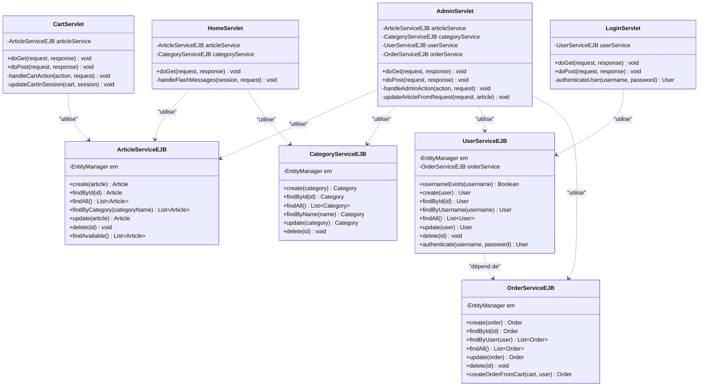
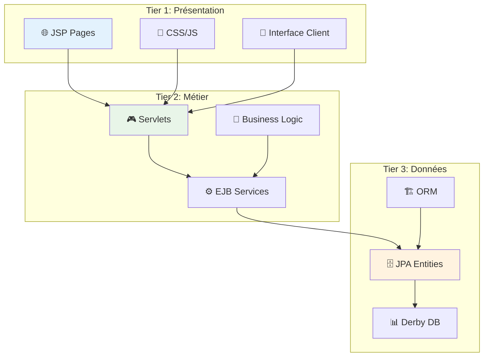
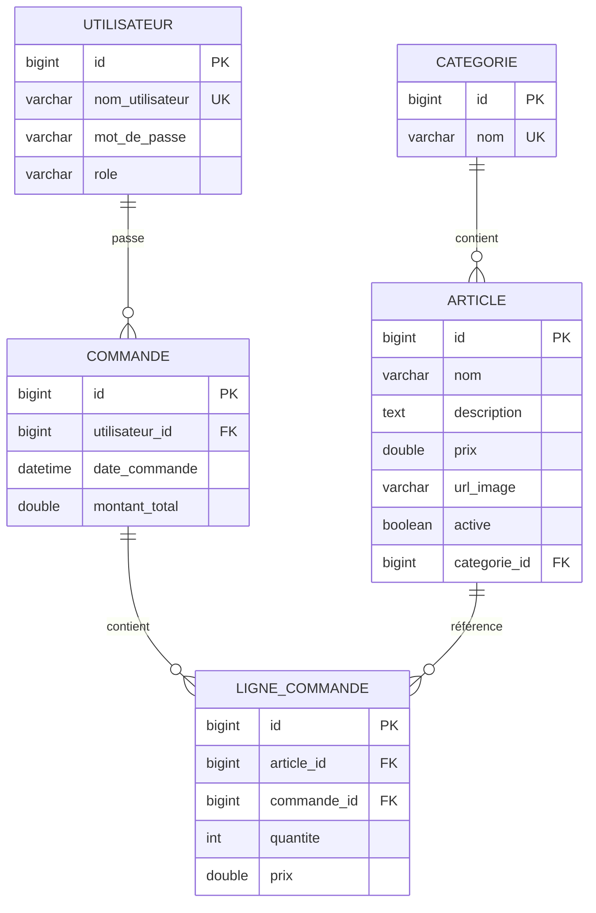

# Diagramme de Classes - Application Élégance

## Diagramme de Classes UML Complet

```mermaid
classDiagram
    class Utilisateur {
        -Long id
        -String nomUtilisateur
        -String motDePasse
        -String role
        +Utilisateur()
        +Utilisateur(nom, motDePasse, role)
        +getId() Long
        +getNomUtilisateur() String
        +setNomUtilisateur(nom)
        +getMotDePasse() String
        +setMotDePasse(motDePasse)
        +getRole() String
        +setRole(role)
    }

    class Categorie {
        -Long id
        -String nom
        -List~Article~ articles
        +Categorie()
        +Categorie(nom)
        +getId() Long
        +getNom() String
        +setNom(nom)
        +getArticles() List~Article~
        +ajouterArticle(article)
        +supprimerArticle(article)
    }

    class Article {
        -Long id
        -String nom
        -String description
        -Double prix
        -String urlImage
        -Categorie categorie
        -Boolean active
        +Article()
        +Article(nom, description, prix, categorie)
        +getId() Long
        +getNom() String
        +setNom(nom)
        +getDescription() String
        +setDescription(description)
        +getPrix() Double
        +setPrix(prix)
        +getUrlImage() String
        +setUrlImage(urlImage)
        +getCategorie() Categorie
        +setCategorie(categorie)
        +getActive() Boolean
        +setActive(active)
    }

    class Commande {
        -Long id
        -Utilisateur utilisateur
        -LocalDateTime dateCommande
        -Double montantTotal
        -List~LigneCommande~ lignes
        +Commande()
        +Commande(utilisateur, date, montant)
        +getId() Long
        +getUtilisateur() Utilisateur
        +setUtilisateur(utilisateur)
        +getDateCommande() LocalDateTime
        +setDateCommande(dateCommande)
        +getMontantTotal() Double
        +setMontantTotal(montantTotal)
        +getLignes() List~LigneCommande~
        +ajouterLigne(ligne)
        +supprimerLigne(ligne)
        +calculerTotal() Double
    }

    class LigneCommande {
        -Long id
        -Article article
        -Integer quantite
        -Double prix
        -Commande commande
        +LigneCommande()
        +LigneCommande(article, quantite, prix)
        +getId() Long
        +getArticle() Article
        +setArticle(article)
        +getQuantite() Integer
        +setQuantite(quantite)
        +getPrix() Double
        +setPrix(prix)
        +getCommande() Commande
        +setCommande(commande)
        +getSousTotal() Double
    }

    class Panier {
        -List~LigneCommande~ articles
        +Panier()
        +ajouterArticle(article, quantite)
        +supprimerArticle(idArticle)
        +modifierQuantite(idArticle, quantite)
        +getArticles() List~LigneCommande~
        +getTotal() Double
        +vider()
        +estVide() Boolean
    }

    %% Relations entre entités
    Utilisateur ||--o{ Commande : "passe"
    Utilisateur ||--o{ Panier : "possède"
    Categorie ||--o{ Article : "contient"
    Article }o--|| Categorie : "appartient à"
    Commande ||--o{ LigneCommande : "contient"
    LigneCommande }o--|| Commande : "appartient à"
    LigneCommande }o--|| Article : "référence"
    Panier ||--o{ LigneCommande : "contient"
```

## Diagramme de Classes - Services et Servlets



## Vue Simplifiée - Architecture 3 Tiers



## Relations Principales



## Instructions pour Exporter

1. **Copiez** le bloc de code Mermaid de votre choix
2. **Allez** sur [mermaid.live](https://mermaid.live)
3. **Collez** le code dans l'éditeur
4. **Cliquez** sur "Export as PNG" ou "Export as SVG"

Ou utilisez VS Code avec l'extension "Mermaid Preview" et faites un clic droit sur le diagramme → "Save as Image".
