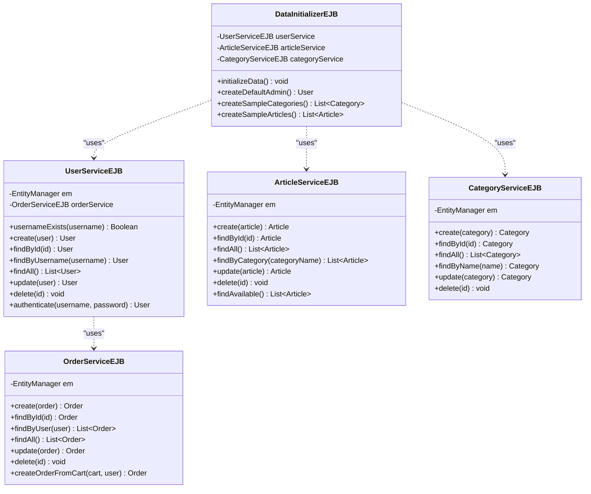

# Diagrammes de l'Application Élégance

## 1. Diagramme de Classes (UML)

### Modèle de Données (Entités JPA)

```mermaid
classDiagram
    class User {
        -Long id
        -String username
        -String password
        -String role
        +User()
        +User(username, password, role)
        +getId() Long
        +getUsername() String
        +setUsername(username)
        +getPassword() String
        +setPassword(password)
        +getRole() String
        +setRole(role)
    }

    class Category {
        -Long id
        -String name
        -List~Article~ articles
        +Category()
        +Category(name)
        +getId() Long
        +getName() String
        +setName(name)
        +getArticles() List~Article~
        +addArticle(article)
        +removeArticle(article)
    }

    class Article {
        -Long id
        -String name
        -String description
        -Double price
        -String imageUrl
        -Category category
        -Boolean enabled
        +Article()
        +Article(name, description, price, category)
        +getId() Long
        +getName() String
        +setName(name)
        +getDescription() String
        +setDescription(description)
        +getPrice() Double
        +setPrice(price)
        +getImageUrl() String
        +setImageUrl(imageUrl)
        +getCategory() Category
        +setCategory(category)
        +getEnabled() Boolean
        +setEnabled(enabled)
    }

    class Order {
        -Long id
        -User user
        -LocalDateTime orderDate
        -Double totalAmount
        -List~OrderItem~ items
        +Order()
        +Order(user, orderDate, totalAmount)
        +getId() Long
        +getUser() User
        +setUser(user)
        +getOrderDate() LocalDateTime
        +setOrderDate(orderDate)
        +getTotalAmount() Double
        +setTotalAmount(totalAmount)
        +getItems() List~OrderItem~
        +addItem(item)
        +removeItem(item)
        +calculateTotal() Double
    }

    class OrderItem {
        -Long id
        -Article article
        -Integer quantity
        -Double price
        -Order order
        +OrderItem()
        +OrderItem(article, quantity, price)
        +getId() Long
        +getArticle() Article
        +setArticle(article)
        +getQuantity() Integer
        +setQuantity(quantity)
        +getPrice() Double
        +setPrice(price)
        +getOrder() Order
        +setOrder(order)
        +getSubtotal() Double
    }

    class Cart {
        -List~OrderItem~ items
        +Cart()
        +addItem(article, quantity)
        +removeItem(articleId)
        +updateQuantity(articleId, quantity)
        +getItems() List~OrderItem~
        +getTotal() Double
        +clear()
        +isEmpty() Boolean
    }

    %% Relations entre entités
    User ||--o{ Order : "place"
    User ||--o{ Cart : "owns"
    Category ||--o{ Article : "contains"
    Article }o--|| Category : "belongs to"
    Order ||--o{ OrderItem : "contains"
    OrderItem }o--|| Order : "belongs to"
    OrderItem }o--|| Article : "references"
    Cart ||--o{ OrderItem : "contains"
```

### Services EJB



### Servlets (Contrôleurs)

```mermaid
classDiagram
    class HomeServlet {
        -ArticleServiceEJB articleService
        -CategoryServiceEJB categoryService
        +doGet(request, response) void
        -handleFlashMessages(session, request) void
    }

    class LoginServlet {
        -UserServiceEJB userService
        +doGet(request, response) void
        +doPost(request, response) void
        -authenticateUser(username, password) User
    }

    class RegisterServlet {
        -UserServiceEJB userService
        +doGet(request, response) void
        +doPost(request, response) void
        -validateRegistration(username, password, confirmPassword) Boolean
    }

    class LogoutServlet {
        +doGet(request, response) void
        -invalidateSession(session) void
    }

    class CartServlet {
        -ArticleServiceEJB articleService
        +doGet(request, response) void
        +doPost(request, response) void
        -handleCartAction(action, request) void
        -updateCartInSession(cart, session) void
    }

    class OrderServlet {
        -OrderServiceEJB orderService
        -UserServiceEJB userService
        +doGet(request, response) void
        +doPost(request, response) void
        -processOrder(cart, user) Order
    }

    class AdminServlet {
        -ArticleServiceEJB articleService
        -CategoryServiceEJB categoryService
        -UserServiceEJB userService
        -OrderServiceEJB orderService
        +doGet(request, response) void
        +doPost(request, response) void
        -handleAdminAction(action, request) void
        -updateArticleFromRequest(request, article) void
    }

    class ArticleDetailServlet {
        -ArticleServiceEJB articleService
        +doGet(request, response) void
        -getArticleStatus(article) String
    }

    class UserManagementServlet {
        -UserServiceEJB userService
        +doGet(request, response) void
        +doPost(request, response) void
    }

    %% Relations entre servlets et services
    HomeServlet ..> ArticleServiceEJB : "uses"
    HomeServlet ..> CategoryServiceEJB : "uses"
    LoginServlet ..> UserServiceEJB : "uses"
    RegisterServlet ..> UserServiceEJB : "uses"
    CartServlet ..> ArticleServiceEJB : "uses"
    OrderServlet ..> OrderServiceEJB : "uses"
    OrderServlet ..> UserServiceEJB : "uses"
    AdminServlet ..> ArticleServiceEJB : "uses"
    AdminServlet ..> CategoryServiceEJB : "uses"
    AdminServlet ..> UserServiceEJB : "uses"
    AdminServlet ..> OrderServiceEJB : "uses"
    ArticleDetailServlet ..> ArticleServiceEJB : "uses"
    UserManagementServlet ..> UserServiceEJB : "uses"
```



## 2. Diagramme de Cas d'Utilisation (UML)

```mermaid
graph TD
    %% Acteurs
    Client[Client]
    Administrateur[Administrateur]
    
    %% Cas d'utilisation généraux
    SInscrire[S'inscrire]
    SeConnecter[Se connecter]
    SeDeconnecter[Se déconnecter]
    
    %% Cas d'utilisation Client
    VoirArticles[Voir les articles]
    RechercherArticles[Rechercher des articles]
    VoirDetails[Voir détails article]
    AjouterPanier[Ajouter au panier]
    VoirPanier[Voir le panier]
    ModifierPanier[Modifier le panier]
    PasserCommande[Passer une commande]
    VoirCommandes[Voir mes commandes]
    VoirDetailsCommande[Voir détails commande]
    
    %% Cas d'utilisation Administrateur
    GererArticles[Gérer les articles]
    AjouterArticle[Ajouter un article]
    ModifierArticle[Modifier un article]
    SupprimerArticle[Supprimer un article]
    GererCategories[Gérer les catégories]
    AjouterCategorie[Ajouter une catégorie]
    ModifierCategorie[Modifier une catégorie]
    SupprimerCategorie[Supprimer une catégorie]
    GererUtilisateurs[Gérer les utilisateurs]
    VoirUtilisateurs[Voir les utilisateurs]
    ModifierRole[Modifier le rôle utilisateur]
    SupprimerUtilisateur[Supprimer un utilisateur]
    GererCommandes[Gérer les commandes]
    VoirToutesCommandes[Voir toutes les commandes]
    VoirDetailsCommandeAdmin[Voir détails commande]
    SupprimerCommande[Supprimer une commande]
    VoirStatistiques[Voir les statistiques]
    
    %% Relations
    Client --> SInscrire
    Client --> SeConnecter
    Client --> SeDeconnecter
    Client --> VoirArticles
    Client --> RechercherArticles
    Client --> VoirDetails
    Client --> AjouterPanier
    Client --> VoirPanier
    Client --> ModifierPanier
    Client --> PasserCommande
    Client --> VoirCommandes
    Client --> VoirDetailsCommande
    
    Administrateur --> SeConnecter
    Administrateur --> SeDeconnecter
    Administrateur --> GererArticles
    Administrateur --> GererCategories
    Administrateur --> GererUtilisateurs
    Administrateur --> GererCommandes
    Administrateur --> VoirStatistiques
    
    %% Inclusions
    GererArticles --> AjouterArticle
    GererArticles --> ModifierArticle
    GererArticles --> SupprimerArticle
    
    GererCategories --> AjouterCategorie
    GererCategories --> ModifierCategorie
    GererCategories --> SupprimerCategorie
    
    GererUtilisateurs --> VoirUtilisateurs
    GererUtilisateurs --> ModifierRole
    GererUtilisateurs --> SupprimerUtilisateur
    
    GererCommandes --> VoirToutesCommandes
    GererCommandes --> VoirDetailsCommandeAdmin
    GererCommandes --> SupprimerCommande
    
    %% Extensions
    AjouterPanier -.-> VoirDetails : <<extend>>
    ModifierPanier -.-> VoirPanier : <<extend>>
    PasserCommande -.-> VoirPanier : <<extend>>
    VoirDetailsCommande -.-> VoirCommandes : <<extend>>
    VoirDetailsCommandeAdmin -.-> VoirToutesCommandes : <<extend>>
```

## 3. Description des Cas d'Utilisation

### Acteurs Principaux

1. **Client** : Utilisateur final qui peut naviguer, acheter des articles et gérer son compte
2. **Administrateur** : Utilisateur avec privilèges pour gérer le contenu et les utilisateurs

### Cas d'Utilisation Clients

| Cas d'Utilisation | Description | Préconditions | Postconditions |
|-------------------|-------------|---------------|---------------|
| S'inscrire | Créer un nouveau compte utilisateur | Aucune | Compte utilisateur créé |
| Se connecter | Accéder à son compte | Compte existe | Session utilisateur active |
| Voir les articles | Afficher la liste des articles disponibles | Aucune | Articles affichés |
| Rechercher articles | Filtrer les articles par critères | Aucune | Résultats de recherche affichés |
| Voir détails article | Consulter les détails d'un article | Aucune | Détails de l'article affichés |
| Ajouter au panier | Ajouter un article au panier d'achat | Connecté | Article ajouté au panier |
| Voir le panier | Consulter son panier d'achat | Connecté | Contenu du panier affiché |
| Modifier le panier | Changer quantités/supprimer articles | Connecté | Panier mis à jour |
| Passer commande | Valider une commande | Panier non vide | Commande créée |
| Voir mes commandes | Consulter l'historique des commandes | Connecté | Commandes affichées |

### Cas d'Utilisation Administrateur

| Cas d'Utilisation | Description | Préconditions | Postconditions |
|-------------------|-------------|---------------|---------------|
| Gérer les articles | CRUD sur les articles | Connecté comme admin | Articles mis à jour |
| Gérer les catégories | CRUD sur les catégories | Connecté comme admin | Catégories mises à jour |
| Gérer les utilisateurs | Gérer les comptes utilisateurs | Connecté comme admin | Utilisateurs mis à jour |
| Gérer les commandes | Voir et gérer toutes les commandes | Connecté comme admin | Commandes traitées |
| Voir les statistiques | Consulter les statistiques de vente | Connecté comme admin | Statistiques affichées |

## 4. Architecture Technique

### Architecture 3-Tiers

```
┌─────────────────┐    ┌─────────────────┐    ┌─────────────────┐
│                 │    │                 │    │                 │
│  Présentation   │    │   Métier        │    │   Données       │
│   (JSP/Servlet) │◄──►│   (EJB)        │◄──►│  (JPA/Derby)   │
│                 │    │                 │    │                 │
│ • home.jsp      │    │ • Services EJB  │    │ • Entities      │
│ • articles.jsp  │    │ • Business Logic│    │ • Derby DB     │
│ • admin.jsp     │    │ • Transactions  │    │ • JPA          │
│ • cart.jsp      │    │                 │    │                 │
│                 │    │                 │    │                 │
└─────────────────┘    └─────────────────┘    └─────────────────┘
```

### Technologies Utilisées

- **Frontend** : JSP, JSTL, HTML5, CSS3, JavaScript, Bootstrap
- **Backend** : Jakarta EE 11, Servlets, JSP, EJB 3.x
- **Persistance** : JPA 3.x, Hibernate, Derby Database
- **Serveur** : GlassFish 8.0.0
- **Build** : Maven
- **Design** : Google Fonts, Font Awesome, CSS Grid/Flexbox

## 5. Flux Principaux

### Flux d'Achat Client

```
Client → Home → Voir Articles → Voir Détails → Ajouter Panier → 
Voir Panier → Modifier Quantités → Passer Commande → Confirmation
```

### Flux Administration

```
Admin → Login → Dashboard → Gérer Articles → 
Ajouter/Modifier/Supprimer → Retour Dashboard
```

Ces diagrammes couvrent l'architecture complète de votre application Élégance avec tous les composants principaux et leurs interactions.
