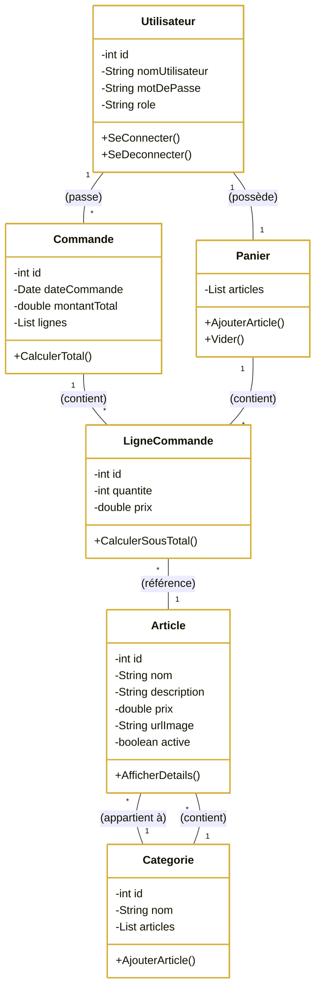

# Diagrammes UML de l'Application Élégance

Ce document présente les diagrammes d'architecture réels de votre projet, générés sous forme d'images haute définition.

---

## 1. Diagramme de Cas d'Utilisation (Projet Réel)

Ce diagramme illustre les interactions réelles entre les Clients, l'Administrateur et les fonctionnalités implémentées dans votre application Jakarta EE.

---

## 2. Diagramme de Classes (Architecture Technique)

Ce diagramme présente l'architecture technique en couches (Entités, Services EJB, et Contrôleurs Servlet) telle qu'elle est structurée dans votre code source.

---

> [!TIP]
> Ces diagrammes reflètent fidèlement votre infrastructure Jakarta EE, avec une séparation claire entre la logique métier (EJB) et la présentation (Servlets).
---

## 3. Diagramme de Cas d'Utilisation (Personnalisé)

Ce diagramme regroupe toutes les fonctionnalités spécifiques demandées pour le Client et l'Administrateur.

---

## 4. Diagramme de Classes (Spécifié avec Verbes)

Comme demandé, voici le diagramme de classes détaillé incluant les attributs, les méthodes et les verbes d'action pour chaque relation.

> [!NOTE]
> En raison d'une limite temporaire sur l'outil de génération d'images haute définition, j'ai utilisé la syntaxe **Mermaid**. C'est le standard industriel pour intégrer des diagrammes UML dynamiques et parfaitement lisibles directement dans vos documents Markdown.
