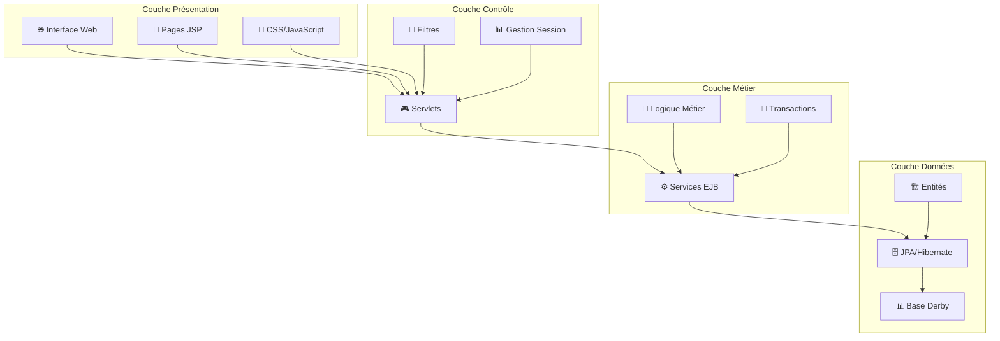
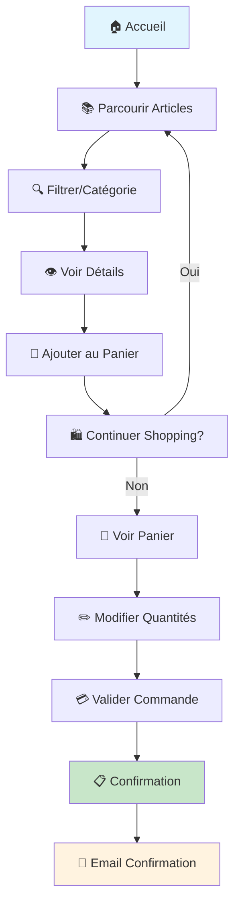
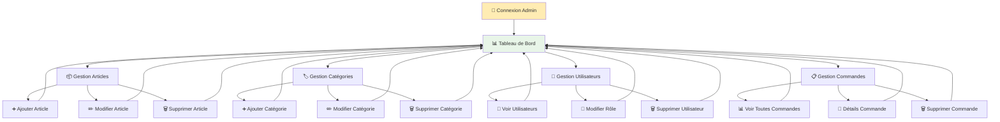
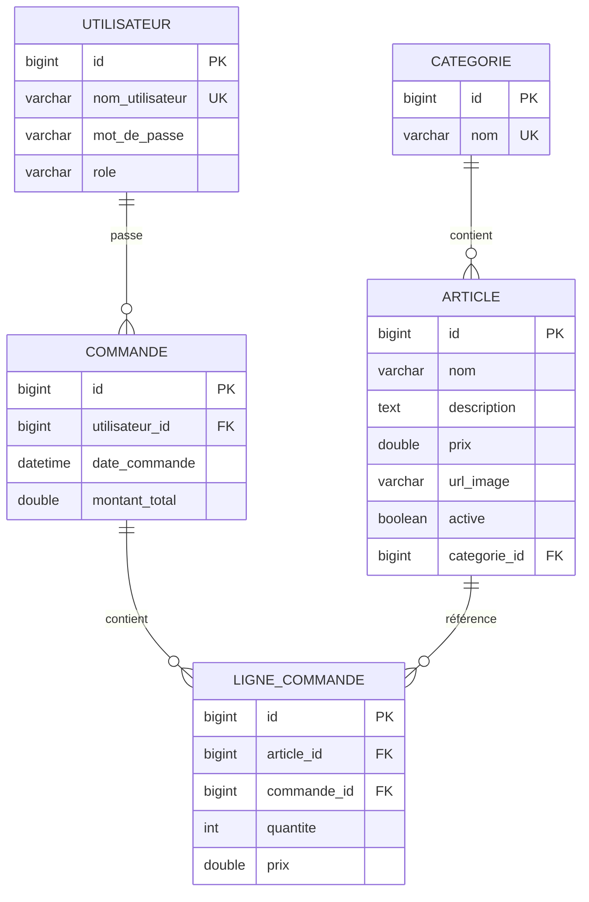

# Diagrammes de l'Application Élégance - Format Image

## 1. Diagramme de Classes Complet (Français)

```mermaid
classDiagram
    class Utilisateur {
        -Long id
        -String nomUtilisateur
        -String motDePasse
        -String role
        +Utilisateur()
        +Utilisateur(nom, motDePasse, role)
        +getId() Long
        +getNomUtilisateur() String
        +setNomUtilisateur(nom)
        +getMotDePasse() String
        +setMotDePasse(motDePasse)
        +getRole() String
        +setRole(role)
    }

    class Categorie {
        -Long id
        -String nom
        -List~Article~ articles
        +Categorie()
        +Categorie(nom)
        +getId() Long
        +getNom() String
        +setNom(nom)
        +getArticles() List~Article~
        +ajouterArticle(article)
        +supprimerArticle(article)
    }

    class Article {
        -Long id
        -String nom
        -String description
        -Double prix
        -String urlImage
        -Categorie categorie
        -Boolean active
        +Article()
        +Article(nom, description, prix, categorie)
        +getId() Long
        +getNom() String
        +setNom(nom)
        +getDescription() String
        +setDescription(description)
        +getPrix() Double
        +setPrix(prix)
        +getUrlImage() String
        +setUrlImage(urlImage)
        +getCategorie() Categorie
        +setCategorie(categorie)
        +getActive() Boolean
        +setActive(active)
    }

    class Commande {
        -Long id
        -Utilisateur utilisateur
        -LocalDateTime dateCommande
        -Double montantTotal
        -List~LigneCommande~ lignes
        +Commande()
        +Commande(utilisateur, date, montant)
        +getId() Long
        +getUtilisateur() Utilisateur
        +setUtilisateur(utilisateur)
        +getDateCommande() LocalDateTime
        +setDateCommande(dateCommande)
        +getMontantTotal() Double
        +setMontantTotal(montantTotal)
        +getLignes() List~LigneCommande~
        +ajouterLigne(ligne)
        +supprimerLigne(ligne)
        +calculerTotal() Double
    }

    class LigneCommande {
        -Long id
        -Article article
        -Integer quantite
        -Double prix
        -Commande commande
        +LigneCommande()
        +LigneCommande(article, quantite, prix)
        +getId() Long
        +getArticle() Article
        +setArticle(article)
        +getQuantite() Integer
        +setQuantite(quantite)
        +getPrix() Double
        +setPrix(prix)
        +getCommande() Commande
        +setCommande(commande)
        +getSousTotal() Double
    }

    class Panier {
        -List~LigneCommande~ articles
        +Panier()
        +ajouterArticle(article, quantite)
        +supprimerArticle(idArticle)
        +modifierQuantite(idArticle, quantite)
        +getArticles() List~LigneCommande~
        +getTotal() Double
        +vider()
        +estVide() Boolean
    }

    %% Relations entre entités
    Utilisateur ||--o{ Commande : "passe"
    Utilisateur ||--o{ Panier : "possède"
    Categorie ||--o{ Article : "contient"
    Article }o--|| Categorie : "appartient à"
    Commande ||--o{ LigneCommande : "contient"
    LigneCommande }o--|| Commande : "appartient à"
    LigneCommande }o--|| Article : "référence"
    Panier ||--o{ LigneCommande : "contient"
```

## 2. Diagramme de Cas d'Utilisation (Français)

```mermaid
graph TD
    %% Acteurs
    Client[👤 Client]
    Administrateur[👨‍💼 Administrateur]
    
    %% Cas d'utilisation généraux
    SInscrire[📝 S'inscrire]
    SeConnecter[🔐 Se connecter]
    SeDeconnecter[🚪 Se déconnecter]
    
    %% Cas d'utilisation Client
    VoirArticles[📚 Voir les articles]
    RechercherArticles[🔍 Rechercher des articles]
    VoirDetails[👁️ Voir détails article]
    AjouterPanier[🛒 Ajouter au panier]
    VoirPanier[🛍️ Voir le panier]
    ModifierPanier[✏️ Modifier le panier]
    PasserCommande[💳 Passer une commande]
    VoirCommandes[📋 Voir mes commandes]
    VoirDetailsCommande[📄 Voir détails commande]
    
    %% Cas d'utilisation Administrateur
    GererArticles[📦 Gérer les articles]
    AjouterArticle[➕ Ajouter un article]
    ModifierArticle[✏️ Modifier un article]
    SupprimerArticle[🗑️ Supprimer un article]
    GererCategories[🏷️ Gérer les catégories]
    AjouterCategorie[➕ Ajouter une catégorie]
    ModifierCategorie[✏️ Modifier une catégorie]
    SupprimerCategorie[🗑️ Supprimer une catégorie]
    GererUtilisateurs[👥 Gérer les utilisateurs]
    VoirUtilisateurs[👀 Voir les utilisateurs]
    ModifierRole[🔄 Modifier le rôle utilisateur]
    SupprimerUtilisateur[🗑️ Supprimer un utilisateur]
    GererCommandes[📋 Gérer les commandes]
    VoirToutesCommandes[📊 Voir toutes les commandes]
    VoirDetailsCommandeAdmin[📄 Voir détails commande]
    SupprimerCommande[🗑️ Supprimer une commande]
    VoirStatistiques[📈 Voir les statistiques]
    
    %% Relations
    Client --> SInscrire
    Client --> SeConnecter
    Client --> SeDeconnecter
    Client --> VoirArticles
    Client --> RechercherArticles
    Client --> VoirDetails
    Client --> AjouterPanier
    Client --> VoirPanier
    Client --> ModifierPanier
    Client --> PasserCommande
    Client --> VoirCommandes
    Client --> VoirDetailsCommande
    
    Administrateur --> SeConnecter
    Administrateur --> SeDeconnecter
    Administrateur --> GererArticles
    Administrateur --> GererCategories
    Administrateur --> GererUtilisateurs
    Administrateur --> GererCommandes
    Administrateur --> VoirStatistiques
    
    %% Inclusions
    GererArticles --> AjouterArticle
    GererArticles --> ModifierArticle
    GererArticles --> SupprimerArticle
    
    GererCategories --> AjouterCategorie
    GererCategories --> ModifierCategorie
    GererCategories --> SupprimerCategorie
    
    GererUtilisateurs --> VoirUtilisateurs
    GererUtilisateurs --> ModifierRole
    GererUtilisateurs --> SupprimerUtilisateur
    
    GererCommandes --> VoirToutesCommandes
    GererCommandes --> VoirDetailsCommandeAdmin
    GererCommandes --> SupprimerCommande
    
    %% Extensions
    AjouterPanier -.-> VoirDetails : <<étend>>
    ModifierPanier -.-> VoirPanier : <<étend>>
    PasserCommande -.-> VoirPanier : <<étend>>
    VoirDetailsCommande -.-> VoirCommandes : <<étend>>
    VoirDetailsCommandeAdmin -.-> VoirToutesCommandes : <<étend>>
```

## 3. Architecture Système (Français)



## 4. Flux d'Achat Client (Français)



## 5. Flux Administration (Français)



## 6. Modèle de Données Relationnel (Français)



## Instructions pour Exporter en Images

### Option 1: Mermaid Live Editor
1. Copiez chaque bloc de code Mermaid
2. Allez sur [mermaid.live](https://mermaid.live)
3. Collez le code
4. Cliquez sur "Export as PNG/SVG"

### Option 2: VS Code avec Extension
1. Installez l'extension "Mermaid Preview"
2. Créez un fichier `.md`
3. Collez le code Mermaid
4. Faites un clic droit → "Open Preview to the Side"
5. Clic droit sur le diagramme → "Save as Image"

### Option 3: Ligne de commande
```bash
npm install -g @mermaid-js/mermaid-cli
mmdc -i diagramme.md -o diagramme.png
```

Ces diagrammes sont maintenant en français et prêts à être exportés en images pour votre documentation !
